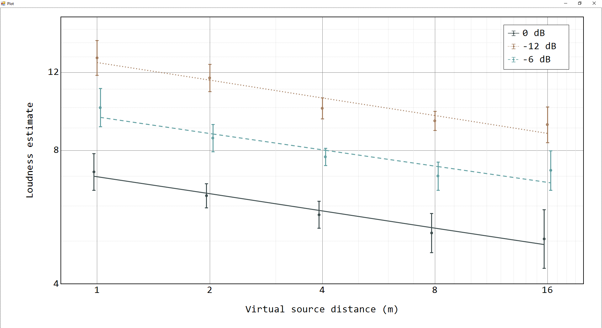
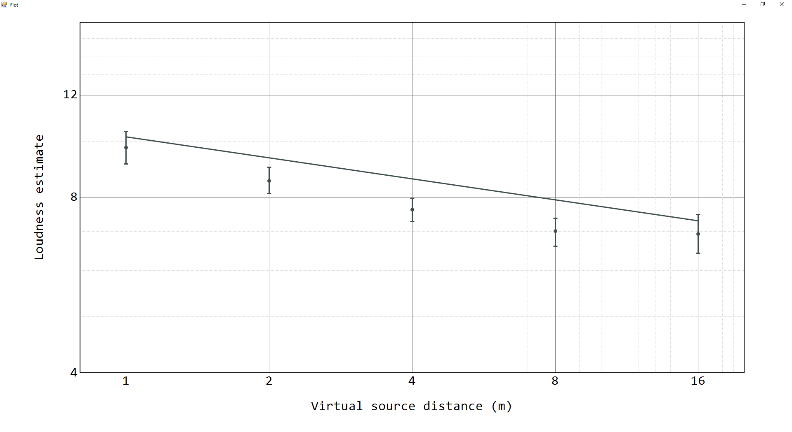
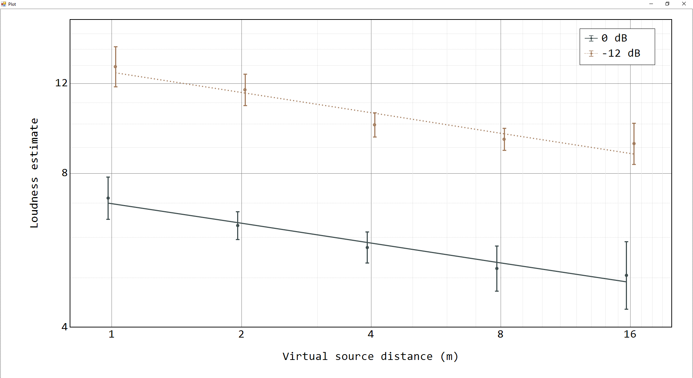

# DataPlotter

Application I made in order to learn Windows Form. It intends at plotting data that is formatted for statistics softwares such as [JASP](https://jasp-stats.org/) or [SPSS](https://www.ibm.com/fr-fr/spss).

I abandonned the development a while back (when I got into R and Python vizualisation libraries) and left some unfinished/bugged features as they are.

## Overall

The aim of this application was to offer some flexibility in plotting Analyses of Variance (ANOVAs) error bars.

An example experiment plan (which is the one of [a published experiment that used the current application for data vizualisation](https://link.springer.com/epdf/10.3758/s13414-023-02719-z?sharing_token=MOLz9o-r4h8R6rYPRsF1spAH0g46feNdnc402WrhzypDQ3w3HrjAhvtsRluKrybx4FM_hbSXxal0s8hoOI7qH7rYuzsXyS7UafjQlafkukKuv-e63sWcsIIu5NgqG3037662nTh9oI-_Fm0AHWOgblZ42MEnhaBoTw8bsQXQa7Q%3D)) will be used for demo, in which loudness estimates are made in three environments, for a source that could either be visible or hidden and was placed at one of 5 distances from the listener, displaying sounds with 3 attenuation levels:

|Independant Variable|Levels|
|:---|---:|
|Environment|Free field Concert hall Sports hall|
|Distance|1 m 2 m 4 m 8 m 16 m|
|Level|0 dB -6 dB -12 dB|
|Visibility|Visible Hidden|

The DataPlotter application allow for easily plotting a given interaction, e.g. the loudness rating as a function of the source distance for each attenuation level:

|Variable selection window|Output vizualisation|
|:---|---:|
|||

## Data input

Statistics softwares that run repeated measures ANOVAs often require the data to be organized as follow:
- Each row represents a participant.
- Each column represents a single combination of the independant variables levels.

The organized data columns would thus be:

|Column|Content|
|:---|---:|
|0|Free field / 1 m / 0 dB / Visible|
|1|Free field / 1 m / 0 dB / Hidden|
|2|Free field / 1 m / -6 dB / Visible|
|3|Free field / 1 m / -6 dB / Hidden|
|...|...|
|89|Sports Hall / 16 m / -12 dB / Hidden|

The home **Set** window of the application asks for a **data file** (comma-separated values, organiazed as seen before) and a **variables info file**, which contains infos on the dependant and independant variables:

|

The **variables info file** should be formatted as follow:
- First line describes the dependent variable
- All other lines describe the independent variables (one per line)
- Each line contains the name of the variable, its type (lin, log or qualitative), its levels (if independent) and its unit (if applicable), separated by semicolons.

The **variables info file** of the example data is provided in `assets/infofile.txt`.

## Variables to vizualise

### Description

The **Variables** window is used for chosing which independant variable(s) (and which of their levels) will be taken into account for the current vizualisation:

|Variable|Appearance|
|:---|---:|
|X-axis|Defines the x axis|
|Y-axis|Defines the y axis|
|Y-axis #2|Plotted on lines of different colors, described in the legend|
|Y-axis #3+|Data is filtered to keep only the selected levels of these variables|

### Examples

|Factors|Variable selection window|Output vizualisation|
|:---|:---:|:---:|
|1 (simple effect)|||
|2|||
|2 (selected levels)|||
|3|||
|3|||

## Chart parameters

The vizualisation is parametrable: the axis ranges, names and types (lin or log), the legend docking position, the ticks and more can be configured in the **Chart** window:

|

## Vizualisation saving

After hitting the **Plot** button, a new window depicting the vizualisation is created. Clicking on that window will export the vizualisation as an Encapsulated PostScript file in the *Documents/DataPlotter* folder.

The vizualisation parameters (including the info and data file paths, the chart configuration and the chosen variables)can be saved by hitting the **Save** button and recalled by hitting **Load existing set** in the **Set** window:

|